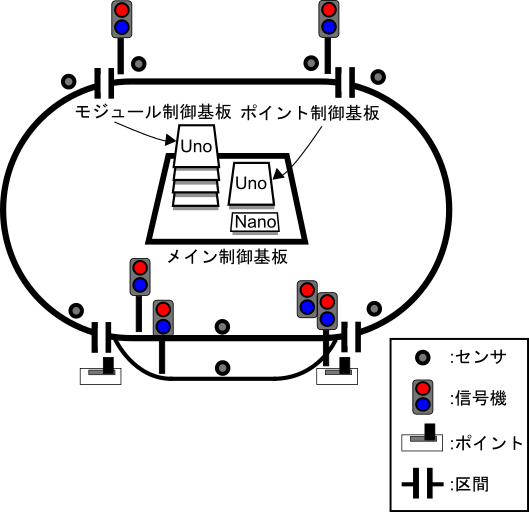

# 鉄道模型プロジェクト
## 概要
このプロジェクトはeChallengeサークル（以下サークルと略す）が鉄道模型を製作するものです。
このプロジェクトはGPLで運用しています。
  
## 内容
ここでは鉄道模型に使用されるシステムの概要を説明します。
このシステムには以下の4つの異なる制御系が搭載されています。

0. コントローラ：RaspberryPi 3B+
1. メイン制御基板：Arduino Nano（以下メインと略す）
2. モジュール制御基板：Arduino Uno[^0]（以下モジュールと略す）
3. ポイント制御基板：Arduino Uno[^0]（以下ポイントと略す）

[^0]:自作制御基板にAtmega328Pを搭載し、Arduino化して使用しています。

##  サークルについて
　毎週日曜日に希望ヶ丘自治会集会所で活動しています。 
電子工作を中心にした「ものづくり系サークル」です。 
13時～14時の1時間にメンバーの作ったモノを披露したり、分からないことや知りたいことを話し合ったりしています。
また、外部のイベントに参加するためにメンバーを募って協力して作品を作ったりします。 
現在メンバーは4名で、常時募集しています。
初心者の方もベテランさんも大歓迎。自分で何かを作りたいという方はぜひお越しください。  

SNSで活動報告を上げています。「いいね」 もらえるとうれしいです。   

***
***
### 0. コントローラ
列車の加減速及び進行方向を操作できるインターフェース。
#### 主な動作
加速レバーとハンドルで列車の速度を操作する。
ディスプレイに出力電圧と電流値が表示される。
進行方向切替スイッチで列車の進行方向を切り替えられる。
***
### 1. メイン
線路全体の運行システムを制御する。
#### 主な動作
モジュールとポイントから線路情報を受信する。
列車が接近している場合、モジュール及びポイントに危険回避の指令を送信する。また進行方向の情報も同時に送信する。
***
### 2. モジュール
一つの区間の列車、信号機を制御する。
#### 主な動作
メインに区間情報を送信する。
線路のセンサを読み取り、区間内の列車の台数を記録する。
メインからの指令に従い、区間用信号機と列車の発車と停車を制御する。
***
### 3. ポイント
一つの待避線、待避線用信号機を制御する。
#### 主な動作
メインにポイント切替状態を送信する。
線路のセンサを読み取り、列車が待避線を通過したことを検出する。
メインからの指令に従い、ポイントを切替える。
***
***